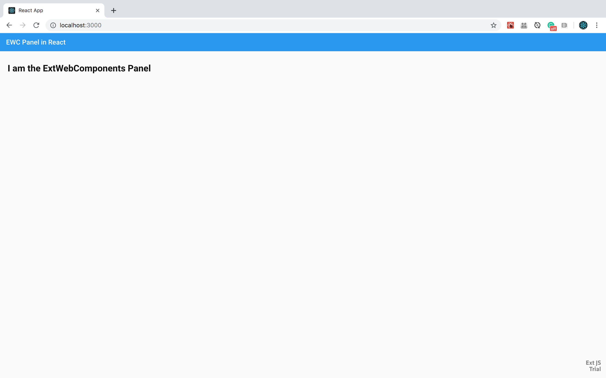

## Adding Sencha ExtWebComponents to a React application created using Create React App

This document defines the steps needed to add Sencha ExtWebComponents to a React application generated with Create React App. Create React App is described in the [Create React App Overview](https://facebook.github.io/create-react-app/)

If you don’t want to follow the below mentioned steps, then you can consume the boilerplate code with a sample ExtWebComponents React application at [ext-web-components-boilerplate-create-react-app](https://github.com/sencha/ext-web-components/tree/ext-components-7.0.x/packages/ext-web-components-boilerplate-create-react-app).

### Create a Create React App starter application

To create a Create React App application, continue in the terminal or command window and 'cd' to the folder where you want to create your new application.  Then, use the following command to create your new Create React App application.

```sh
npx create-react-app ext-web-components-boilerplate-create-react-app
```

The create-react-app starts up and will generate a base React application

Once the 'npx create-react-app' command is finished, move to the newly created folder and run the application:

```sh
cd  ext-web-components-boilerplate-create-react-app
npm start
```

A browser window should appear at http://localhost:3000/ (or go to http://localhost:3000/ in your browser).  You should see a page with a React logo and a message: 'Edit src/App.js and save to reload.' in the browser.

more details at: https://facebook.github.io/create-react-app/docs/getting-started

Now, stop the 'npm start' app from running in the terminal/command window (ctrl-c).  This prepares you for the next steps.

### Perform Eject.

One way to expose the webpack configuration is to perform an eject in the project. [npm run eject is described here](https://facebook.github.io/create-react-app/docs/available-scripts#npm-run-eject)

Alternatives to ejecting (such as forking the 'react-scripts' git repo) are discussed [here](https://facebook.github.io/create-react-app/docs/alternatives-to-ejecting)

To run eject, type the following command in the terminal window:

```sh
npm run eject
```

* For the question: 'Are you sure you want to eject? This action is permanent.', type 'y' and press 'enter'

This command copies all the config files and dependencies into your project and now you can make appropriate changes to consume the ext-webpack-plugin.

### Add Sencha ExtWebComponents to your Create React App starter application

To Add ExtWebComponents to your newly created Create React App starter application, bring up the created application in your favorite editor or IDE - for example, to use Visual Studio Code, cancel the currently running sample application in the terminal or command window and type 'code .' in the terminal or command window.

```sh
code .
```

For the next steps, make sure you are logged into the Sencha npm repository - for instructions, see this link: https://github.com/sencha/ext-web-components/blob/ext-components-7.0.x/README.md

#### Do 1 of the next 2 steps:

either...
Add the following to the dependencies section of package.json:

```sh
"@sencha/ext": "^7.0.0",
"@sencha/ext-modern": "^7.0.0",
"@sencha/ext-modern-theme-material": "^7.0.0",
"@sencha/ext-web-components-modern": "~7.1.0",
"@sencha/ext-webpack-plugin": "^7.0.0",
"@webcomponents/webcomponentsjs": "^2.2.10",
"copy-webpack-plugin": "^5.0.4",
```

To install the npm dependencies, in the terminal or command window run the following:

```sh
npm install
```

or...
Run the following commands in the terminal/command window:

```sh
npm install --save @sencha/ext-web-components @sencha/ext @sencha/ext-modern @sencha/ext-modern-theme-material
npm install --save @sencha/ext-webpack-plugin
npm install --save @webcomponents/webcomponentsjs
npm install --save copy-webpack-plugin

```

#### Edit config/webpack.config.js, public/index.html, src/App.js and src/index.js

To configure the ext-webpack-plugin inside application, we update **config/webpack.config.js** in three steps:

1. open config/webpack.config.js in your editor
2. At the top of the file, after the 'use strict' statement, add the following to look like this:
```sh
'use strict';

const ExtWebpackPlugin = require('@sencha/ext-webpack-plugin');
const CopyWebpackPlugin = require('copy-webpack-plugin');
```

3. do a search for this string:

new HtmlWebpackPlugin


4. below the definition for the HtmlWebpack plugin (should be around or on line 506, the line that contains '),' ), add the following:

```sh
new ExtWebpackPlugin({
    framework: 'web-components',
    toolkit: 'modern',
    theme: 'theme-material',
    emit: 'yes',
    script: '',
    packages: [],
    profile: '',
    browser: 'no',
    verbose: 'no',
    inject: 'no'
}),
new CopyWebpackPlugin([{
    from: './node_modules/@webcomponents/webcomponentsjs/webcomponents-bundle.js',
    to: './webcomponents-bundle.js'
}]),
```

5. do a search for this string (around or on line 154):

path: isEnvProduction ? paths.appBuild : undefined,

6. Update this line with the following line:
```sh
path: isEnvProduction ? paths.appBuild : paths.appPublic,
```
7. save config/webpack.config.js in your editor

8. open public/index.html in your editor

**Now after configuration, you are ready to use Ext-Web-Components inside the application.**

9. Add Ext.js and Ext.css inside the inside public/index.html and also webcomponents-bundle.js for the compatibility of Web Components with all major browsers.  the file should look like this (the example below has removed the comments from the original public/index.html file):

```sh
<!DOCTYPE html>
<html lang="en">
  <head>
    <meta charset="utf-8" />
    <link rel="shortcut icon" href="%PUBLIC_URL%/favicon.ico" />
    <meta name="viewport" content="width=device-width, initial-scale=1" />
    <meta name="theme-color" content="#000000" />
    <link rel="manifest" href="%PUBLIC_URL%/manifest.json" />

    <script src="webcomponents-bundle.js"></script>
    <link rel="stylesheet" href="%PUBLIC_URL%/ext/ext.css">

    <title>React App</title>
  </head>
  <body>
    <noscript>You need to enable JavaScript to run this app.</noscript>

    <script src="%PUBLIC_URL%/ext/ext.js"></script>

    <div id="root"></div>
  </body>
</html>
```

10. save public/index.html in your editor

11. open src/App.js in your editor

12. in src/App.js replace the code with:

```sh
import '@sencha/ext-web-components/lib/ext-panel.component';
import React from 'react';
import './App.css';

function App() {
  return (
    <ext-panel
      title="EWC Panel in React"
      bodyPadding="20px"
    >
      <h1>I am the ExtWebComponents Panel</h1>
    </ext-panel>
  );
}

export default App;
```

13. save src/App.js in your editor

#### Run the application

In the terminal or command window, run the application:

```sh
npm start
```

Browse to http://localhost:3000 in your browser.  You should see the React starter application with an ExtWebComponents Panel in the browser.


