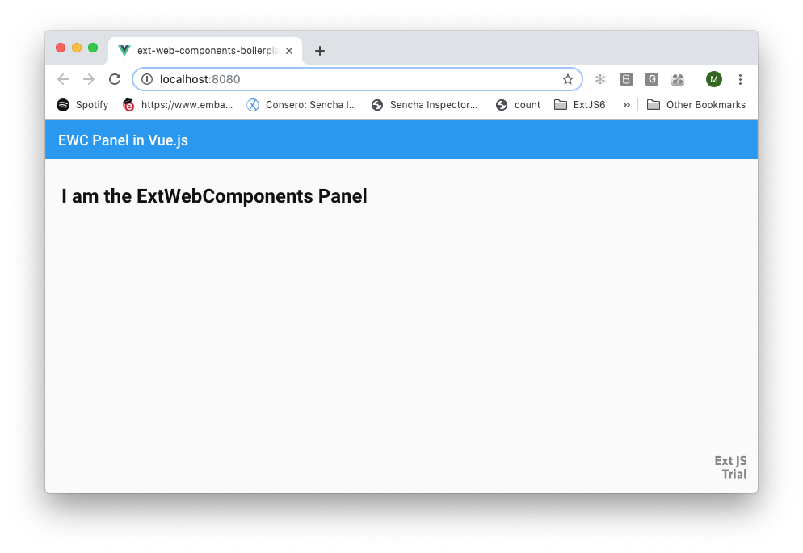

## Adding Sencha ExtWebComponents to a Vue CLI application

This document defines the steps needed to add Sencha ExtWebComponents to a Vue.js application generated with Vue CLI.  Vue CLI is described in the [Vue CLI Overview](https://cli.vuejs.org/guide/)

If you don’t want to follow the below mentioned steps, then you can consume the boilerplate code with a sample ExtWebComponents application at [ext-web-components-boilerplate-vue-cli](https://github.com/sencha/ext-web-components/tree/ext-components-7.0.x/packages/ext-web-components-boilerplate-vue-cli).

### Install the Vue CLI

more details at: https://cli.vuejs.org/guide/installation.html

To install Vue CLI, bring up a terminal or command window and use the following command:


```sh
npm install -g @vue/cli
```

### Create a Vue CLI starter application 

more details at: https://cli.vuejs.org/guide/creating-a-project.html#vue-create

To create a Vue CLI starter application, continue in the terminal or command window and 'cd' to the folder where you want to create your new application.  Then, use the following command to create your new Vue CLI application.

```sh
vue create ext-web-components-boilerplate-vue-cli
```

Vue CLI starts up and then asks a series of questions as selections - either refer to the Vue documentation noted above or answer as follows:

* For 'Please pick a preset:' , select 'Manually select features'
* For 'Check the features needed for your project:', unselect 'Linter / Formatter' and press 'enter'
* For 'Where do you prefer placing config for Babel, PostCSS, ESLint, etc.?', select the default (press 'enter')
* For 'Save this as a preset for future projects?', select the default (press 'enter')

The 'vue create' command will run.

Once the 'vue create' command is finished, move to the newly created folder and run the application:

```sh
cd  ext-web-components-boilerplate-vue-cli
npm run serve
```

Browse to http://localhost:8080 in your browser.  You should see the 'Welcome to Your Vue.js App' page in the browser.

Now, stop the 'create vue' app from running in the terminal/command window (ctrl-c).  This prepares you for the next steps.

### Add Sencha ExtWebComponents to your Vue CLI starter application

To Add ExtWebComponents to your newly created Vue CLI starter application, bring up the created application in your favorite editor or IDE - for example, to use Visual Studio Code, cancel the currently running sample application in the terminal or command window and type 'code .' in the terminal or command window.

```sh
code .
```

For the next steps. make sure you are logged into the Sencha npm repository - for instructions, see this link: https://github.com/sencha/ext-web-components/blob/ext-components-7.0.x/README.md

#### Do 1 of the next 2 steps:

either...
Add the following to the dependencies section of package.json:

```sh
"@sencha/ext-web-components": "^7.0.0",
"@sencha/ext": "^7.0.0",
"@sencha/ext-modern": "^7.0.0",
"@sencha/ext-modern-theme-material": "^7.0.0",
"@sencha/ext-webpack-plugin": "^7.0.0",
"@webcomponents/webcomponentsjs": "^2.2.10"
```

To install the npm dependencies, in the terminal or command window run the following:

```sh
npm install
```

or...
Run the following commands in the terminal/command window:

```sh
npm install --save @sencha/ext-web-components @sencha/ext @sencha/ext-modern @sencha/ext-modern-theme-material
npm install --save @sencha/ext-webpack-plugin
npm install --save @webcomponents/webcomponentsjs
```

To configure the ext-webpack-plugin for webpack in Vue, create a file named vue.config.js at the root directory (where the package.json is), and add the following:
```sh
const ExtWebpackPlugin = require('@sencha/ext-webpack-plugin');
const path = require('path');

module.exports = {
  devServer: {
    contentBase: 'build',
    hot: true,
    historyApiFallback: true,
    host: '0.0.0.0',
    port: '8080',
    disableHostCheck: false,
    compress: false,
    inline: true,
    stats: 'none',
  },
  outputDir: path.join(__dirname, 'build'),
  configureWebpack: {
    plugins: [
        new ExtWebpackPlugin({
            framework: 'web-components',
            toolkit: 'modern',
            emit: 'yes',
            browser: 'no',
            packages: [],
            profile: '',
            verbose: 'no',
            treeshake:'no',
            environment: 'development'
        }),
    ]
  }
}
```

Replace src/main.js with the following:

```sh
/*global Ext*/
import Vue from 'vue'
import App from './App.vue'
import '@sencha/ext-web-components/lib/ext-panel.component';

Ext.onReady(function() {
  new Vue({
    render: h => h(App)
  }).$mount('#app')
});
```

Replace src/App.vue with the following:

```sh
<template>
    <ext-panel
        title="EWC Panel in Vue.js"
        bodyPadding="20px"
    >
        <h1>I am the ExtWebComponents Panel</h1>
    </ext-panel>
</template>
<script>
    export default {
        name: 'app',
    }
</script>
```

In the terminal or command window, run the application:

```sh
npm run serve
```

Browse to http://localhost:8080 in your browser.  You should see the Vue.js starter application with an ExtWebComponents Panel in the browser.


